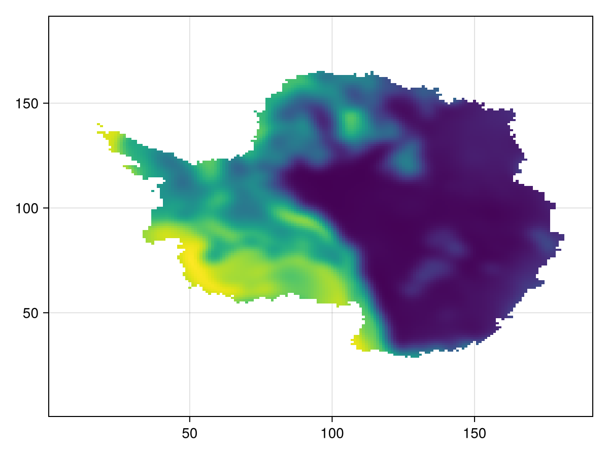
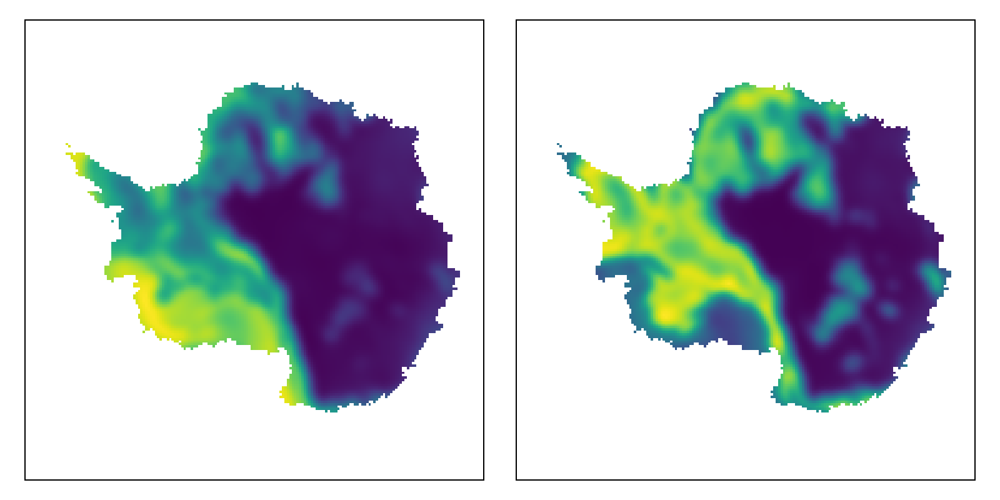

# Regridding

## Getting started

This project is authored by Jan Swierczek-Jereczek. To (locally) reproduce it, do the following:

1. Download this code base. Notice that raw data are typically not included in the
   git-history and may need to be downloaded independently.
2. Open a Julia console and do:
   ```
   julia> using Pkg
   julia> Pkg.add("DrWatson") # install globally, for using `quickactivate`
   julia> Pkg.activate("path/to/this/project")
   julia> Pkg.instantiate()
   ```

This will install all necessary packages for you to be able to run the scripts and
everything should work out of the box, including correctly finding local paths.

You may notice that all scripts start with the command:
```julia
include("intro.jl")
```
which activates the project, imports important packages and enables local path handling from DrWatson.

## Introduction

This repository aims to centralise the julia regridding routines used within the palma-ice group. The internal workflow can be summarized as:

1. Load the source data on the source grid by using `NetCDF.jl` and define an interpolator by using `Interpolations.jl`. We here require the user to have preprocessed their data into a NetCDF file.
1. Define the target grid. For this we use `LazyGrids.jl`, which is memory-efficient and simple to use.
2. Compute the associated coordinates on the projection where the source data is defined. For this we use `Proj.jl` which offers a wide range of transformations that can be easily adjusted through keyword arguments.
3. Pass the target grid to the interpolator.

We propose to illustrate this with an example, where the geothermal heat flux (GHF) data from Hazzard and Richards (2024) is regridded from lon-lat to stereographic:

```julia
using CairoMakie, Interpolations, NetCDF, Proj

# Step 1
filepath = datadir("BCs/Hazzard-Richards-2024/HR24_GHF_mean.nc")
lon = ncread(filepath, "lon")
lat = ncread(filepath, "lat")
μ_ghf = ncread(filepath, "z")
μ_ghf_itp = linear_interpolation((lon, lat), μ_ghf, extrapolation_bc = (Periodic(), Flat()))

# Step 2
x = range(-3040f3, stop = 3040f3, step = 32f3)
y = copy(x)
X, Y = ndgrid(x, y)

# Step 3
source2target = Proj.Transformation("EPSG:4326", "+proj=stere +lat_0=-90 +lat_ts=-80", always_xy=true)
target2source = inv(source2target)
coords = target2source.(X, Y)
Lon = map(x -> x[1], coords)
Lat = map(x -> x[2], coords)

# Step 4
μ_new = μ_ghf_itp.(Lon, Lat)
heatmap(μ_new)
```



This code snippet is presents some important drawbacks:
- it is somewhat verbose,
- it is not generic,
- it gets particularly tedious when having various files and/or variables,
- it does not include a general routine to save the results to a new netCDF file.

This is addressed by the convenience functions implemented in `StructuredRegridding`:

```julia
# Load all packages and routines that are needed
include("intro.jl")

# Define regridding config
source_dimnames = ("lon", "lat")
target_dimnames = ("x", "y")
varnames = ("z",)
filename = "BCs/Hazzard-Richards-2024/HR24_GHF"
source_gridname = "EPSG:4326"
target_gridname = "+proj=stere +lat_0=-90 +lat_ts=-80"
extrapolation_boundary_conditions = (Periodic(), Flat())

# Define mean GHF regridding
regrid_μ_ghf = StructuredRegridding(
    datadir("$(filename)_mean.nc"),
    source_dimnames,
    target_dimnames,
    source_gridname,
    target_gridname,
    varnames,
    extrapolation_boundary_conditions,
)

# Define stddev GHF regridding
regrid_σ_ghf = StructuredRegridding(
    datadir("$(filename)_std.nc"),
    source_dimnames,
    target_dimnames,
    source_gridname,
    target_gridname,
    varnames,
    extrapolation_boundary_conditions,
)

# Regridding
x = range(-3040f3, stop = 3040f3, step = 32f3)
y = copy(x)
target_dims = (x, y)
target_grid = ndgrid(target_dims...)

# Filter out missing values and pack into a tuple.
target_μ = regrid_μ_ghf(target_grid)[1]
target_σ = regrid_σ_ghf(target_grid)[1]
varnames = ("mu_ghf", "sigma_ghf")
vars = (target_μ, target_σ)

# Visualize regridded data for sanity check
fig = Figure(size = (800, 400))
for j in eachindex(varnames)
    ax = Axis(fig[1, j], aspect = DataAspect())
    hidedecorations!(ax)
    heatmap!(ax, vars[j])
end
fig

# Save regridded data
x_atts = Dict("units" => "m", "long_name" => "x-coordinate")
y_atts = Dict("units" => "m", "long_name" => "y-coordinate")
dim_atts = (x_atts, y_atts)

μ_ghf_atts = Dict("units" => "mW/m^2", "long_name" => "Mean geothermal heat flux")
σ_ghf_atts = Dict("units" => "mW/m^2", "long_name" =>
    "Standard deviation of geothermal heat flux")
var_atts = (μ_ghf_atts, σ_ghf_atts)

fn = datadir("$filename-regridded.nc")
save2nc(fn, target_dimnames, target_dims, dim_atts, varnames, vars, var_atts)
```



That's it!

There are other ways to perform this operation and we here want to briefly outline why we chose to use the one outlined above. `Interpolations.jl` is a performant and well-maintained package that offers a user-friendly treatment of the boundary conditions, which is important for geoscientific application, for isntance when we use lon-lat grids. However, `Interpolations.jl` **requires rectangular grids** as source. This is achieved with the workflow above and could not be done so easily if we would project the `(lon, lat)` vectors to `(x, y)`.

## Resources

The projections of `Proj.jl` are numerous and sometimes a bit cryptic at first glance but a thorough description of them can be found at https://proj.org/en/9.4/operations/projections/index.html.

## Future developments

1. accept delimited files as input with cols = (x, y, ..., data)

## Conventions

In future, we will try to make `StructuredRegridding.jl` as general as possible. For now, we however prefer to define some important conventions that prevent such flexibility but ease the initial development:

1. We **always** use `(lon, lat)` ordering.

## Visualization

Visualizing data constitutes the main step of a sanity check. For this, we use `CairoMakie.jl`.

Additionally, `Geostats.jl` is included in this project since it offers a nice interface to filter data, include units, visualize non-equispaced data... etc. However it is not ready yet to perform the regridding task we here focus on (might come in future releases).